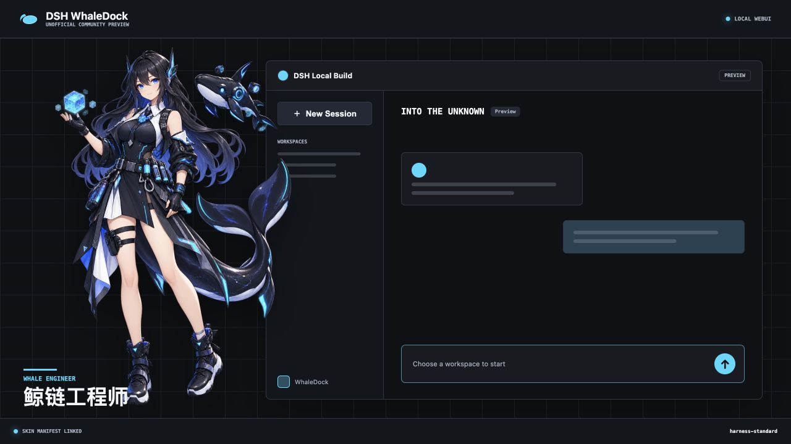
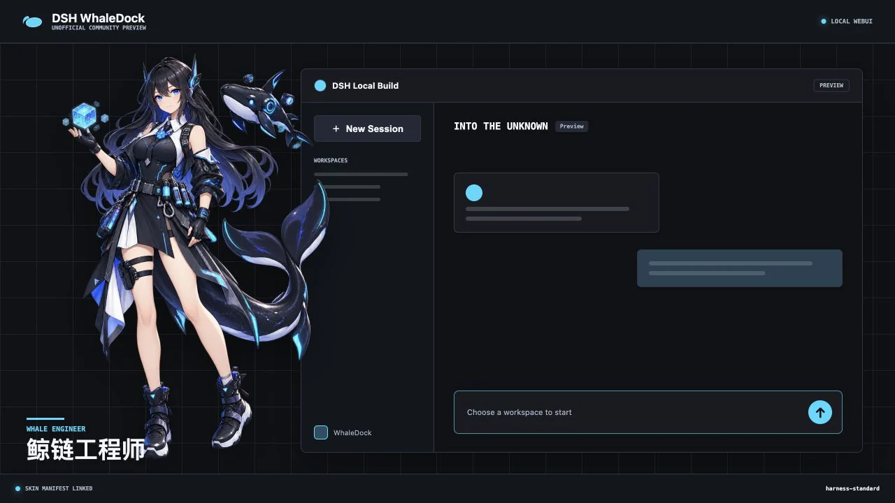
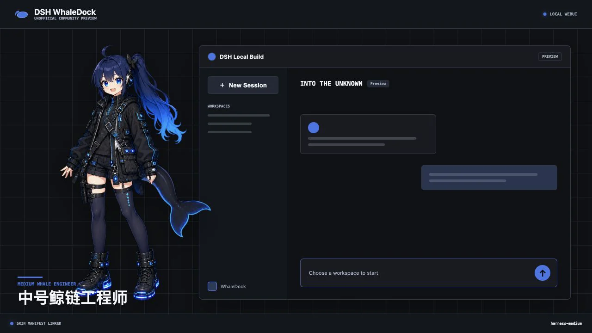
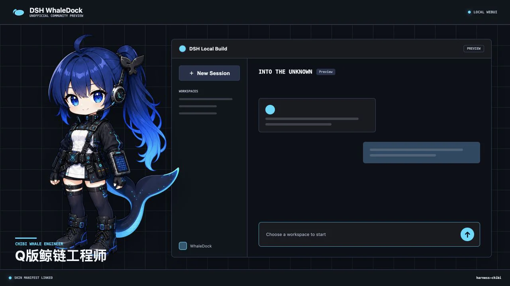
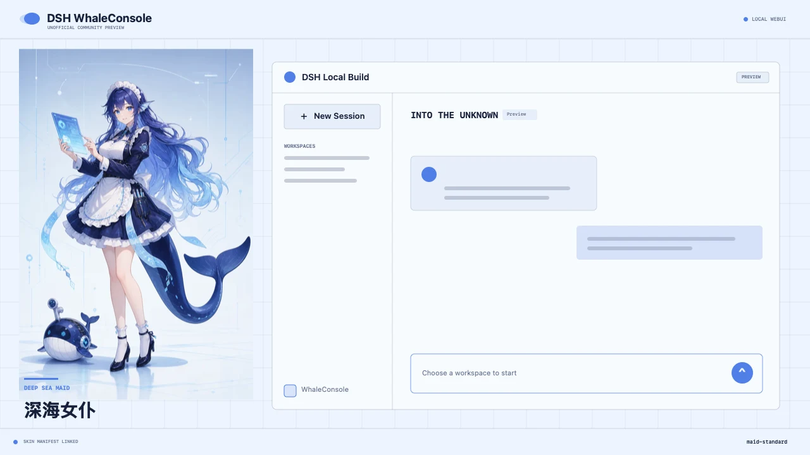
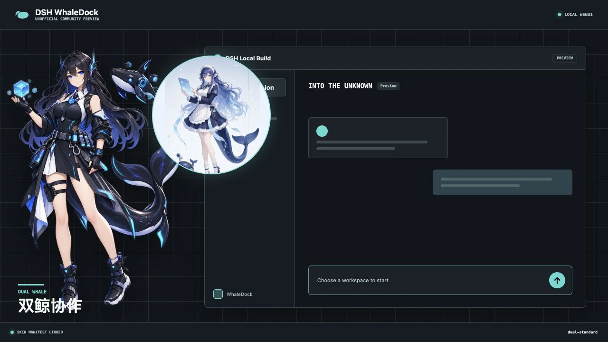

# DSH WhaleConsole

English | [简体中文](README.zh-CN.md)

DSH WhaleConsole is an unofficial macOS launcher and WebUI theme plugin for DeepSeek Harness (DSH). The Preview release turns the local WebUI workflow into a game-launcher-style desktop experience while keeping the actual DSH page in its own window.



## Preview Scope

- Start, stop, restart, and inspect a local DSH WebUI service.
- Open WebUI in a separate native webview window.
- Keep the launcher available from the macOS menu bar.
- Detect externally-owned services without stopping them.
- Switch among five built-in skins from the launcher skin box, each with its own fixed 16:9 preview image.
- Switch WebUI skins at any time from the sidebar skin box, with live mascot and palette updates.
- Add a mascot overlay, sidebar shortcut, and plugin settings card through official additive slots.
- Persist WhaleConsole settings through the DSH settings namespace.

The baseline for `0.2.1-preview.1` is DSH `0.1.1-rc.2` and Node.js `^22.19.0 || >=24.0.0`.

## Built-in Skins

| Whale Engineer | Medium Whale Engineer |
| --- | --- |
|  |  |

| Chibi Whale Engineer | Deep Sea Maid |
| --- | --- |
|  |  |

| Dual Whale |
| --- |
|  |

## Repository

```text
apps/launcher/       Tauri 2 macOS launcher and React interface
packages/plugin/     Installable DSH Bundle + Client plugin
packages/skins/      Shared skin manifest and palette registry
scripts/agent/       Deterministic source-build and validation helpers
.agents/skills/      Agent-readable installation workflow
docs/                Architecture, artwork, and release notes
.github/             CI, dependency updates, and contribution templates
dist/                Locally built Preview artifacts
```

## Documentation

- [Architecture](docs/ARCHITECTURE.md)
- [Source installation](INSTALL.md)
- [Character profiles](docs/CHARACTERS.md)
- [Original artwork](docs/ARTWORK.md)
- [Preview release checklist](docs/PREVIEW-CHECKLIST.md)
- [Release process](docs/RELEASING.md)
- [Security policy](SECURITY.md)
- [Contributing](CONTRIBUTING.md)
- [Changelog](CHANGELOG.md)
- [Asset license](ASSET_LICENSE.md)
- [AI-assisted creation disclosure](AI_DISCLOSURE.md)

## Source Build and Agent Setup

WhaleConsole Preview is source-first. Build the plugin archive and unsigned macOS app locally with:

```sh
pnpm install --frozen-lockfile
pnpm agent:preflight
pnpm build:preview -- --skip-install
```

Users with a local coding Agent can give it this short request:

```text
Read INSTALL.md, load .agents/skills/dsh-whale-console-install/SKILL.md, and
follow the repository source-build workflow. Ask before changing a DSH
profile, stopping a service, installing system dependencies, or copying the
app to /Applications.
```

The complete manual and Agent workflow is documented in [INSTALL.md](INSTALL.md). The Agent instructions do not grant permission to change system dependencies, a live DSH profile, or macOS security settings.

## Try the Launcher

```sh
pnpm install
pnpm --filter @dsh-whale-console/launcher dev
```

Open `http://127.0.0.1:1420/` for the browser preview. Native development needs Rust and the macOS Command Line Tools:

```sh
pnpm --filter @dsh-whale-console/launcher tauri:dev
```

The launcher discovers `pnpm` and Node.js from the login shell and defaults to `~/deepseek-harness`. The project path, `pnpm` path, log directory, and WebUI port are editable in Settings.

## Runtime Diagnostics

Logs default to `~/Library/Logs/DSH WhaleConsole/dsh-whale-console.log`. The directory is created on first start and can be changed to another absolute or `~/...` path in Settings.

When launched from Finder, WhaleConsole passes the login-shell `PATH` to DSH so package-manager scripts can find Node.js. It also enables polling for the source checkout's WebUI watchers to avoid the lower file-descriptor limit commonly inherited by macOS GUI applications.

## Install the Plugin

The package is not published to npm yet. Build a local tarball and install it into the DSH Web profile:

```sh
pnpm --filter dsh-whale-console run pack
dsh plugin --profile web add /absolute/path/to/dsh-whale-console-0.2.1-preview.1.tgz
```

After a registry Preview is published, the intended command is:

```sh
dsh plugin --profile web add dsh-whale-console@preview
```

## Verify

```sh
pnpm typecheck
pnpm test
DSH_REPO=/absolute/path/to/deepseek-harness pnpm --filter dsh-whale-console test:composition
```

The composition test creates a temporary DSH home, installs the packed plugin, checks the composed Host config, starts WebUI, confirms the client boot graph, and fetches the lazy-CJS browser bundle.

## Build macOS

```sh
pnpm --filter @dsh-whale-console/launcher tauri:build:app
```

`pnpm build:preview` also packs the plugin, creates the app ZIP, and verifies checksums. Public binary distribution still needs an Apple Developer ID signature and notarization.

## Project Status

This is a developer Preview. It has not received a security audit, and its compatibility target is intentionally narrow. See [SECURITY.md](SECURITY.md), [architecture](docs/ARCHITECTURE.md), and the [release checklist](docs/PREVIEW-CHECKLIST.md).

This project is not affiliated with, endorsed by, or sponsored by DeepSeek. DSH and DeepSeek Harness are used descriptively. No official logo or upstream brand asset is included.

Code is MIT licensed. Original character artwork is CC BY 4.0; see [ASSET_LICENSE.md](ASSET_LICENSE.md).

Parts of the code, documentation, design, and original artwork were created or revised with generative AI under human direction and review. See [AI_DISCLOSURE.md](AI_DISCLOSURE.md).
